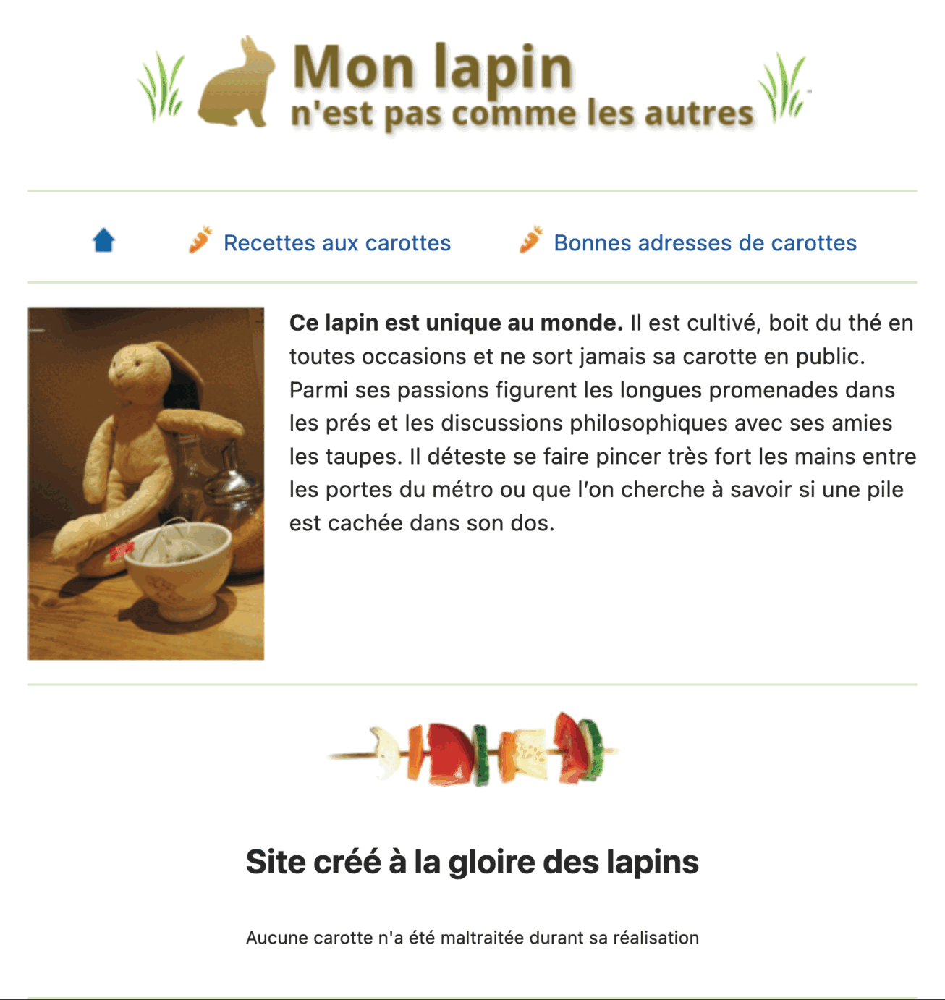

# html-image-alt

> HTML exercise about images (and alt attribute)

* * *

**html-image-alt** is an educational project, which will be used for HTML courses.

**Note:** the school where the course is given, the [HEPL](http://www.provincedeliege.be/hauteecole) from Liège, Belgium, is a french-speaking school. From this point, the instruction will be in french. Sorry.

* * *

## Exercice sur les images et l’attribut `alt`

Complétez le fichier `index.html` avec les bonnes balises afin d'arriver au résultat présenté dans le rendu ci-dessous.
Cet exercice porte sur les alternatives textuelles aux images. Soyez attentifs aux divers cas d’usage qui ne manqueront pas d’être présents dans ce document et définissez les valeurs des attributs nécessaires en fonction. 

Bon travail !

